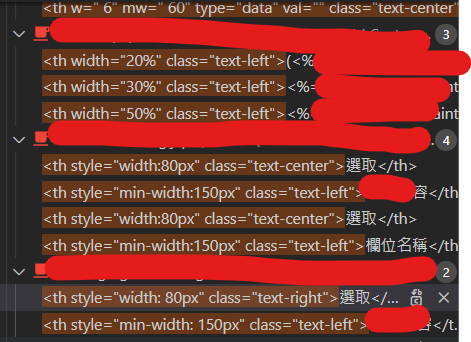
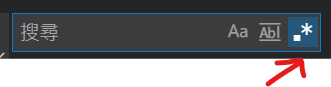
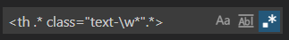
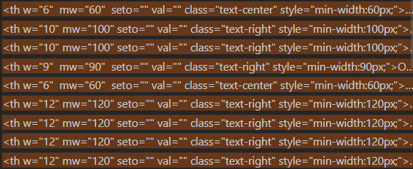
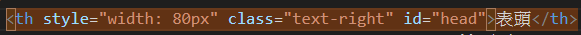
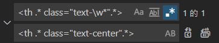
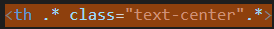
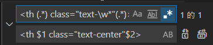
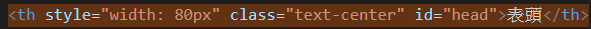

# 正則表達式快速取代文字

如果專案中需要取代某`特定模式`的字串，但一般搜尋無法簡單定位這些字串，可以用正則表達式處理。

## 情境

假如一個專案中有1000個 html 檔，其中有部份使用到<th> tag，但是該tag的內容文字對齊，有些是靠左，有些是置中，有些是靠右。



現在老闆希望將這些混亂的文字統一改成置中，請問要如何修改?

一般情況會想到直接用 VS code的全域取代功能，把`text-left`取代成 `text-center`，但可想而知這樣會遇到一些問題：

- 如果`text-left`不是專門給`th`使用，那在一般搜尋中直接搜尋`text-left`，會把所有其他 tag，比如`span`也搜出來。
- 為了避免搜出其他 tag，只好搜尋`<th class="text-left"`，但從上圖可知，th 和 class之間又有其他字，所以這樣搜尋是不可行的。

## 解決方案

如果1000個檔案要一個檔案一個檔案去檢查，一定會花上非常多時間。

以下用兩步來解決這個問題：

### 搜尋

使用 VSCode 的搜尋時，可以開啟正則表達式來搜尋。



簡單分析一下要搜尋字串的模式：

```
<th style="width: 80px" class="text-right">XXX</th>
```

- style 到 class 這段文字是變數
- class 之後是變數

那麼搜尋時應該要把這些變數忽略來搜尋，可以使用

```
.*
\w*
```

- `.` 表示 match 任意字元
- `\w` 表示 match 英文字母大小寫和數字和 _
- `*` 表示 match 0~多個字元

合在一起表示 match 零到多個任意字元。

因此搜尋可以改成

```
<th .* class="text-\w*".*>
```



在這裡變數的部份用了3個

1. class 前面，可以放任意數量的任意字元
2. class 裡面，text 後面可以放任意數量的任意字元
3. class 後面，可以放任意數量的任意字元

因此可以搜出下列結果：




### 取代

第一步用正規表達式搜尋已經完成了，但是取代是另一個問題。

比方說，我想要把以下`th`的 class，取代成 `text-center`



如果直接這樣寫



取代結果會是




因此，要使用正則表達式中的變數。

1. 用小括號把原本的正則表達式括起來
2. 記住順序
3. 取代時用錢字號$ + 順序數字來取代

```
<th $1 class="text-center"$2>
```



取代後的結果：




